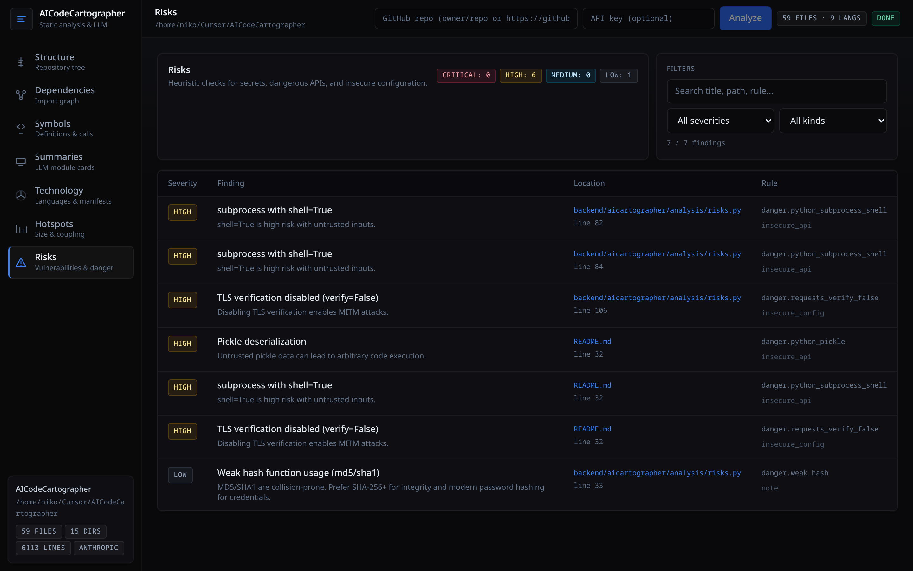

# AICodeCartographer

> Point it at any project. Get a beautiful, interactive map of the code.

`aicartographer` walks a repository, parses every supported file with
[tree-sitter](https://tree-sitter.github.io), and opens a local dashboard with
eleven views on the codebase:

| View | What you get |
| --- | --- |
| **Overview** | Deterministic architecture brief — purpose, modules, tech stack, dependency hubs, top risks and vulnerabilities |
| **Ask** | Grounded Q&A over this scan's artifacts (brief, deps, symbols, risks, vulns) with citations; optional LLM |
| **Architecture** | Layer map — folder clusters and aggregated cross-layer imports |
| **Structure** | Markmap of the project tree; click any node to drill in |
| **Dependencies** | Force-directed import graph; focus a node to highlight its neighborhood |
| **Symbols** | Classes, functions, methods, and call edges — filterable by folder and kind |
| **Summaries** | Natural-language summary per source file (optional LLM), streamed live |
| **Technology** | Languages by lines of code; frameworks and libraries from manifests |
| **Hotspots** | Largest files, most-imported modules, complexity, and git churn |
| **Risks** | Heuristic security checks **and** OSV dependency vulnerabilities (two tabs) |
| **Changes** | Diff two saved scans, or **PR review** (`base` vs `head` git refs) — files, deps, risks, and vulns |

Static analysis works without any API key. Optional **LLM summaries** use Anthropic, OpenAI, or local Ollama; responses are cached on disk by content hash so re-scans only spend tokens on changed files.

**Note:** LLM-powered summaries and the **Ask** view are still new and have **not yet been tested thoroughly**. Treat them as experimental and verify outputs before relying on them.

## Outstanding features

Five capabilities that turn the dashboard into a daily-driver intelligence tool:

| Feature | What it does |
| --- | --- |
| **Ask** | Chat grounded in *this scan* — brief, deps, symbols, risks, vulns, and file excerpts. Answers include clickable citations. |
| **Architecture** | Folder-layer map with aggregated cross-layer imports and risk counts per layer. |
| **MCP** | `aicartographer mcp` — stdio server so Cursor (and other agents) can call `get_brief`, `search_codebase`, `get_risks`, `get_vulns`, `get_file_neighbors`, and `get_architecture_map` while you edit. |
| **PR review** | Scan git `base` vs `head` in one step (local repo or `owner/repo`), then open **Changes** with a semantic summary. |
| **Watch** | `aicartographer watch` or the header toggle — debounced incremental re-parse while you code; artifacts refresh over SSE. |

## Dashboard shortcuts

- **Search** (`Ctrl+K`) — jump to files, symbols, risk findings, OSV rows, or module summaries from one palette
- **Export** — download a standalone HTML report (Markdown via `?format=md` on the API)
- **Keys** — store OpenAI/Anthropic API keys encrypted under `AICARTOGRAPHER_HOME/secrets/` (never sent back to the browser)
- **Changes** — pick Scan A and Scan B from recent analyses, or run a git ref review (`main` vs `feature`)
- **Watch** — keep the dashboard live while you edit (incremental re-parse; toggle in the header)
- **MCP** — `aicartographer mcp` exposes brief, search, risks, vulns, and neighbors to Cursor agents (stdio)

## Security (Risks view)

### Heuristics (offline)

Best-effort pattern matching — not a full SAST tool. Surfaces items such as:

- **Secrets**: private key blocks, AWS access key ids, likely `api_key` / `token` assignments
- **Dangerous APIs**: `eval`/`exec`, `subprocess` with `shell=True`, `pickle.load(s)`, unsafe `yaml.load`, `verify=False`
- **Remediation hints** where applicable (e.g. prefer `shell=False` with an argument list)

### Dependencies (OSV)

Queries the [OSV](https://osv.dev) API for known CVEs in **pinned** dependencies found in:

- `requirements.txt` (`==` pins)
- `pyproject.toml` (PEP 621 and Poetry sections)
- `poetry.lock`
- `package-lock.json`, `yarn.lock`, `pnpm-lock.yaml`

OSV lookup requires network access during the scan. Unpinned or missing lockfiles may yield an empty vulnerabilities tab even when the project has deps.

## Screenshots

| | |
| :--: | :--: |
|  |  |
| Welcome screen — run an analysis or jump back into a recent one. | Structure — click any node to drill in. |
|  |  |
| Module dependency graph — fcose layout, neighborhood highlight on click. | Symbol graph — classes, functions, methods and their calls. |
|  |  |
| Summaries — natural-language summaries streamed in as they finish. | Technology — languages by LoC plus frameworks/libraries detected from manifests. |
|  | |
| Hotspots — largest files, most-imported modules, complexity, and git churn. | |
|  | |
| Risks — heuristics and OSV dependency vulnerabilities. | |

## Languages supported (out of the box)

`tree-sitter` powered analysis: **Python**, **JavaScript**, **TypeScript**, **TSX**.

Lightweight stats + tech detection: **Go**, **Rust**, **Java**, **Kotlin**, **C**, **C++**, **Ruby**, **PHP**, **Swift**, **Scala**, **Vue**, **Svelte**, shell, SQL, HTML, CSS/SCSS, YAML, TOML, JSON, Markdown.

Adding a deeper grammar is a small change in [`backend/aicartographer/parsers/treesitter.py`](backend/aicartographer/parsers/treesitter.py).

## Install

```bash
git clone https://github.com/dpastoetter/AICodebaseCartographer.git aicartographer
cd aicartographer

python -m venv .venv && source .venv/bin/activate
pip install -e ".[all]"

cd frontend
npm install
npm run build
cd ..
```

## Usage

```bash
aicartographer scan /path/to/your/project
```

This starts a local FastAPI server, kicks off the scan, and opens `http://localhost:<port>/?scan=<id>` in your browser. The dashboard updates live via Server-Sent Events.

### Scan a public GitHub repo

Paste into the **Start** panel or the header bar:

- `owner/repo`
- `https://github.com/owner/repo`

The backend clones into `AICARTOGRAPHER_HOME/clones/` (default `~/.aicartographer/clones/`) and scans the working copy. Public repos only.

### Enable AI summaries

```bash
# Anthropic Claude
export ANTHROPIC_API_KEY=sk-ant-...
aicartographer scan ./repo --llm anthropic   # default: claude-3-5-haiku-latest

# OpenAI
export OPENAI_API_KEY=sk-...
aicartographer scan ./repo --llm openai --model gpt-4o-mini

# Ollama (local, no cloud key)
aicartographer scan ./repo --llm ollama --model llama3.1
```

Or configure keys in the UI via **Keys** (encrypted local storage). Environment variables still work as a fallback.

### CLI flags

| Flag | What it does |
| --- | --- |
| `--llm none` (default) | Static analysis only — no API key required |
| `--port 0` | Pick any free port (default) |
| `--host 0.0.0.0` | Expose to your LAN (use with care) |
| `--no-open` | Don't auto-open the browser |
| `--max-files N` | Cap files scanned (useful on huge repos) |

### Living scan (watch mode)

```bash
aicartographer watch /path/to/your/project
```

Runs a full scan, enables filesystem watch (2s debounce), and incrementally refreshes deps, symbols, hotspots, risks, and the brief. In the UI, use the **Watch** toggle in the header on a completed scan.

### MCP server (Cursor / agents)

```bash
aicartographer mcp
```

Stdio JSON-RPC server with tools: `get_brief`, `search_codebase`, `get_risks`, `get_vulns`, `get_file_neighbors`, `get_architecture_map`, `list_scans`.

Add to Cursor **Settings → MCP** (or `.cursor/mcp.json`):

```json
{
  "mcpServers": {
    "aicartographer": {
      "command": "aicartographer",
      "args": ["mcp"]
    }
  }
}
```

Run a scan first so artifacts exist under `~/.aicartographer/scans/`. Use `list_scans` to pick a `scan_id`.

### PR review (git refs)

On the **Changes** view, enter a repo path or `owner/repo`, plus `base` (e.g. `main`) and `head` (e.g. `feature/my-branch`). The backend checks out both refs via git worktrees, runs two scans, and shows the diff.

Or via API:

```bash
curl -X POST http://127.0.0.1:8765/api/scans/review \
  -H 'Content-Type: application/json' \
  -d '{"repo": "/path/to/repo", "base": "main", "head": "feature/foo"}'
```

## API (selected endpoints)

| Method | Path | Description |
| --- | --- | --- |
| `GET` | `/api/scans` | List saved scans |
| `POST` | `/api/scans` | Start scan (local path) |
| `POST` | `/api/scans/from-repo` | Clone and scan a GitHub repo |
| `GET` | `/api/scans/{id}/brief` | Architecture brief |
| `GET` | `/api/scans/{id}/vulns` | OSV vulnerability report |
| `GET` | `/api/scans/compare?a=&b=` | Diff two scans |
| `POST` | `/api/scans/review` | Scan git `base` vs `head`, return compare |
| `POST` | `/api/scans/{id}/ask` | Grounded Q&A (JSON) |
| `GET` | `/api/scans/{id}/ask/stream?q=` | Ask via SSE |
| `GET` | `/api/scans/{id}/architecture` | Layer map |
| `GET` | `/api/scans/{id}/search?q=` | Search index |
| `GET` | `/api/scans/{id}/neighbors?path=` | Import neighbors |
| `POST` / `DELETE` | `/api/scans/{id}/watch` | Enable / disable watch mode |
| `GET` | `/api/scans/{id}/export?format=html\|md` | Export report |
| `GET` | `/api/secrets` | Which LLM keys are configured (booleans only) |
| `POST` | `/api/secrets/{provider}` | Set `openai` or `anthropic` key |
| `DELETE` | `/api/secrets/{provider}` | Clear a stored key |

## Architecture

```
CLI / MCP (stdio) -> FastAPI -> Walker -> tree-sitter -> Analysis -> JSON snapshots
                                              |                              |
                                              +---- Watch (debounced) -------+
                                              \-> LLM (summaries + Ask) -> SSE -> React UI
```

- Walker honors `.gitignore` via `pathspec` and skips common build/cache directories and binary files.
- Each scan persists artifacts under `~/.aicartographer/scans/<scan_id>/`:
  `tree.json`, `dependencies.json`, `symbols.json`, `tech.json`, `hotspots.json`, `risks.json`, `vulns.json`, `brief.json`, `cards/*.json`, `status.json`
- Reopening a past scan from **Recent analyses** is instant.
- LLM responses are cached at `~/.aicartographer/llm-cache/` keyed by provider, model, prompt version, path, and file content hash.
- Override the data directory with `AICARTOGRAPHER_HOME=/path`.

See [`backend/aicartographer/`](backend/aicartographer/) and [`frontend/src/`](frontend/src/) for the full layout.

## Development

```bash
# Backend (auto-reload)
uvicorn aicartographer.server:create_app --factory --app-dir backend --port 8765

# Frontend (proxies /api to :8765)
cd frontend && npm run dev
# http://localhost:5173/?scan=<scan_id>
```

### Tests

```bash
pytest backend/tests -q
ruff check backend
cd frontend && npx tsc --noEmit
```

### Screenshots

```bash
pip install playwright
python -m playwright install chromium
python scripts/take_screenshots.py
```

After UI changes, regenerate screenshots so the gallery matches the current **Overview**, **Ask**, **Architecture**, **Changes**, and Risks tabs.

## License

[MIT](LICENSE) © 2026 dpastoetter
