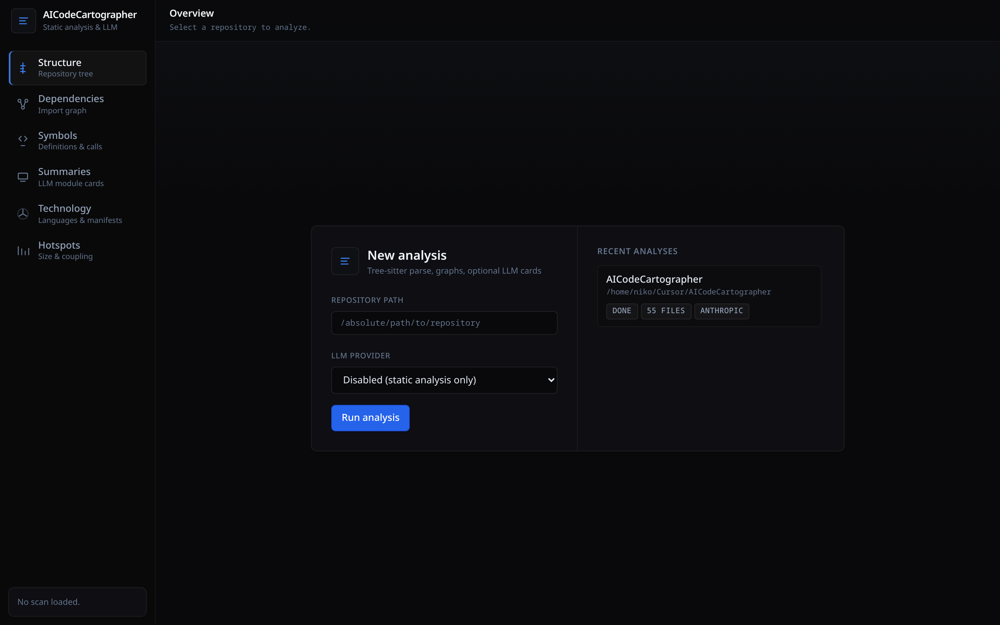
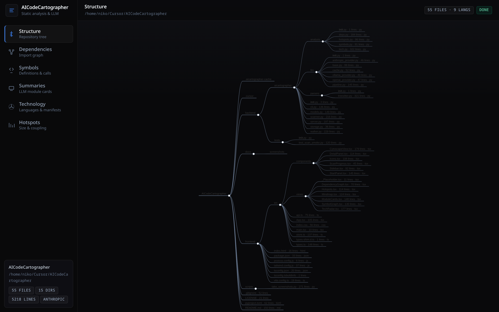
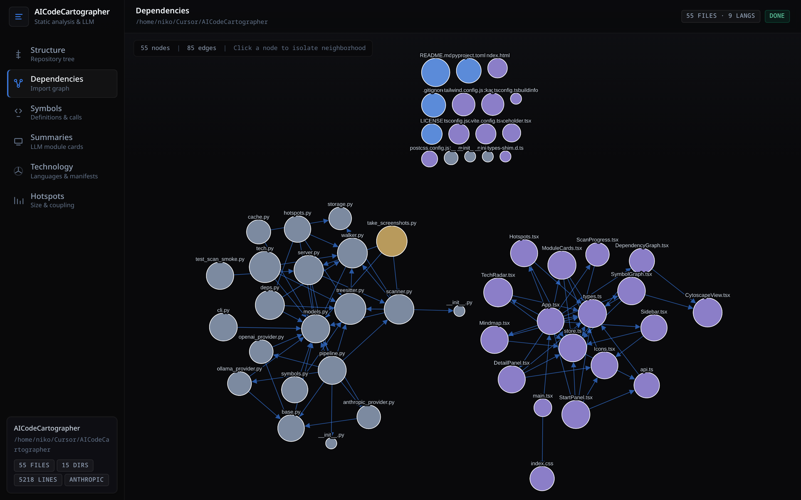
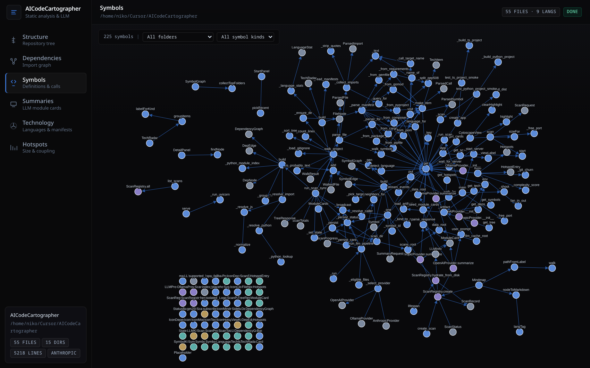
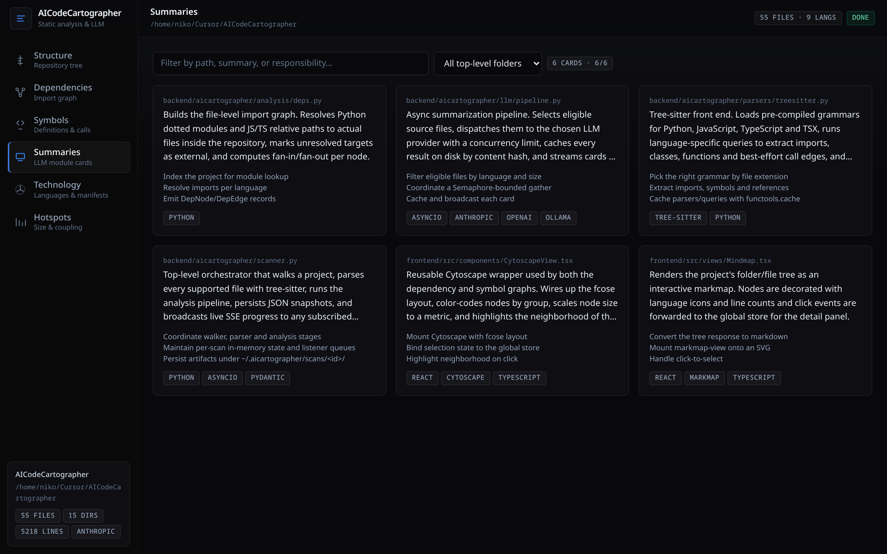
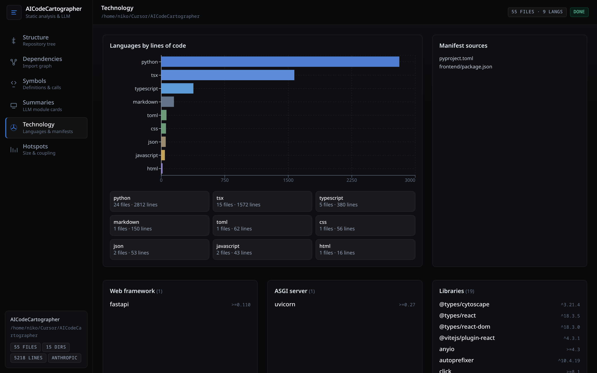
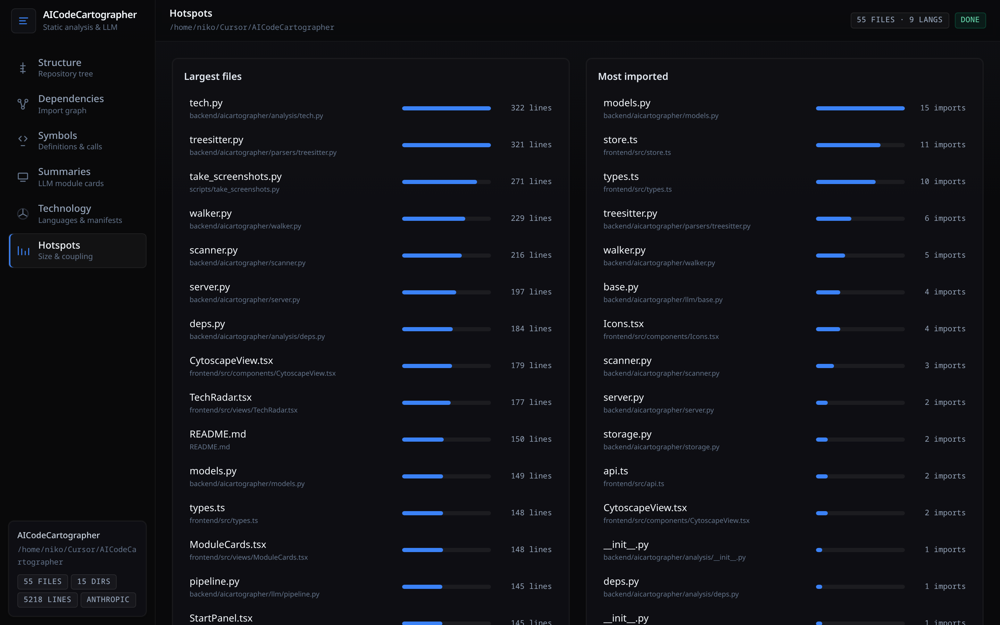

# AICodeCartographer

> Point it at any project. Get a beautiful, interactive map of the code.

`aicartographer` walks a repository, parses every supported file with
[tree-sitter](https://tree-sitter.github.io), and opens a local dashboard with
six lenses on the codebase:

- **Structure** - a markmap of the project shape, click to drill in.
- **Module dependency graph** - force-directed import graph, focus a node to
  highlight its neighborhood.
- **Symbol graph** - classes / functions / methods and their call edges,
  filterable by folder and kind.
- **Summaries** - one natural-language summary per source file,
  generated by your choice of LLM and streamed in live as they finish.
- **Technology** - languages by lines of code, plus every framework, library
  and tool detected from `package.json`, `pyproject.toml`, `Cargo.toml`,
  `go.mod`, `pom.xml`, `Gemfile`, etc.
- **Hotspots** - largest files, most-imported modules, complexity score, and
  recent git churn (when `.git` is available).

Static analysis is always available. The AI summaries are powered by a
**pluggable provider**: Anthropic Claude, OpenAI, or a local Ollama model.
Cards are cached on disk by content hash, so re-running a scan only spends
tokens on files that actually changed.

## Screenshots

| | |
| :--: | :--: |
|  |  |
| Welcome screen — run an analysis or jump back into a recent one. | Structure — click any node to drill in. |
|  |  |
| Module dependency graph — fcose layout, neighborhood highlight on click. | Symbol graph — classes, functions, methods and their calls. |
|  |  |
| Summaries — natural-language summaries streamed in as they finish. | Technology — languages by LoC plus frameworks/libraries detected from manifests. |
|  | |
| Hotspots — largest files, most-imported modules, complexity, and git churn. | |

## Languages supported (out of the box)

`tree-sitter` powered analysis: **Python**, **JavaScript**, **TypeScript**,
**TSX**.
Lightweight stats + tech detection: **Go**, **Rust**, **Java**, **Kotlin**,
**C**, **C++**, **Ruby**, **PHP**, **Swift**, **Scala**, **Vue**, **Svelte**,
shell, SQL, HTML, CSS/SCSS, YAML, TOML, JSON, Markdown.

Adding a deeper grammar is a 3-line change in
[`backend/aicartographer/parsers/treesitter.py`](backend/aicartographer/parsers/treesitter.py).

## Install

```bash
git clone https://github.com/dpastoetter/AICodebaseCartographer.git aicartographer
cd aicartographer

python -m venv .venv && source .venv/bin/activate
pip install -e ".[all]"

cd frontend
npm install
npm run build
cd ..
```

## Usage

```bash
aicartographer scan /path/to/your/project
```

This starts a local FastAPI server, kicks off the scan, and opens
`http://localhost:<port>/?scan=<id>` in your browser. The dashboard updates
live via Server-Sent Events as the scan progresses.

To enable AI module cards, pick a provider:

```bash
# Anthropic Claude
export ANTHROPIC_API_KEY=sk-ant-...
aicartographer scan ./repo --llm anthropic               # default model: claude-3-5-haiku-latest

# OpenAI
export OPENAI_API_KEY=sk-...
aicartographer scan ./repo --llm openai --model gpt-4o-mini

# Ollama (private, local, no API key)
aicartographer scan ./repo --llm ollama --model llama3.1
```

Other useful flags:

| Flag | What it does |
| --- | --- |
| `--llm none` (default) | Static analysis only - no API key required |
| `--port 0` | Pick any free port (default) |
| `--host 0.0.0.0` | Expose to your LAN (use with care) |
| `--no-open` | Don't auto-open the browser |
| `--max-files N` | Cap files scanned (useful on huge repos) |

## Architecture

```
CLI -> FastAPI server -> Walker -> tree-sitter -> Analysis pipeline -> JSON snapshots
                                                                  \-> LLM provider -> SSE -> UI
```

- Walker honors `.gitignore` via `pathspec` and skips common build/cache
  directories and binary files.
- Each scan persists every artifact under
  `~/.aicartographer/scans/<scan_id>/` (`tree.json`, `dependencies.json`,
  `symbols.json`, `tech.json`, `hotspots.json`, `cards/*.json`). Reopening a
  past scan from the dashboard's "Recent scans" list is instant.
- LLM responses are cached at `~/.aicartographer/llm-cache/<sha256>.json`,
  keyed by `provider + model + prompt-version + relative-path + file-content`.
- Override the on-disk root with `AICARTOGRAPHER_HOME=/path`.

See [`backend/aicartographer/`](backend/aicartographer/) and
[`frontend/src/`](frontend/src/) for the full layout.

## Development

```bash
# Backend dev server with auto-reload
uvicorn aicartographer.server:app --reload --app-dir backend --port 8765

# Frontend dev server (proxies /api to :8765)
cd frontend && npm run dev
# open http://localhost:5173/?scan=<scan_id>
```

Tests:

```bash
pytest backend/tests -q
ruff check backend
cd frontend && npx tsc --noEmit
```

Re-generate the screenshots in [`docs/screenshots/`](docs/screenshots/):

```bash
pip install playwright
python -m playwright install chromium
python scripts/take_screenshots.py
```

## License

[MIT](LICENSE) © 2026 dpastoetter
